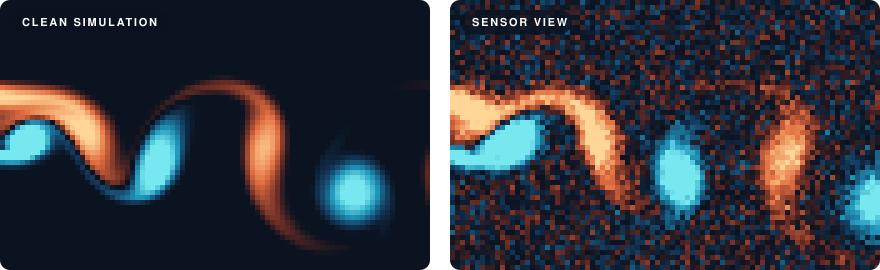
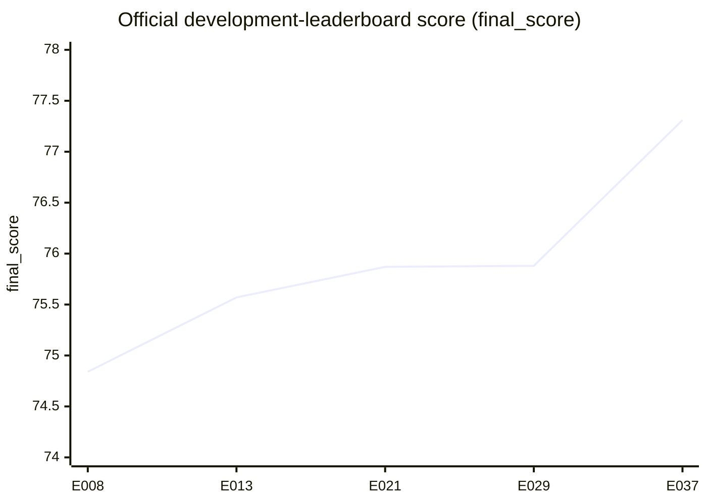

<h1 align="center">RealPDE · Track 1 — Sim-to-Real</h1>

<p align="center">
  <b>Teaching a neural operator raised on clean simulations to forecast messy, real water-tunnel flow.</b>
</p>

<p align="center">
  <a href="https://realpdecompetition.github.io/"></a>
  <a href="https://www.codabench.org/competitions/17363/"></a>
  <a href="RESULTS.md"></a>
  
  
  <a href="LICENSING.md"></a>
</p>

<p align="center">
  <a href="METHOD.md">Method</a> ·
  <a href="RESULTS.md">Results</a> ·
  <a href="LEDGER.md">Experiment ledger</a> ·
  <a href="REPRODUCING.md">Reproducing</a>
</p>

---

## The gap in one picture

<p align="center">
  
</p>
<p align="center">
  <sub>An illustration I generated, not competition data: the wake of a NACA4418 airfoil from a small lattice-Boltzmann simulation (left), and the same flow degraded the way PIV measurements are (right). <a href="docs/assets/README.md">How it was made</a></sub>
</p>

The organizers' pretrained models learned from clean simulations like the left
panel. They're graded on measurements from a real water tunnel, taken with
particle image velocimetry (PIV), which look a lot more like the right: grainy,
blurred, and never quite in step with the simulation. (The
[competition website](https://realpdecompetition.github.io/#about) shows the
real side-by-side.)

Track 1 of the [RealPDE Competition](https://realpdecompetition.github.io/)
asks a simple-sounding question: **can a model trained mostly on the left
panel make useful predictions about the right one?**

> **The task:** watch 20 frames of measured velocity (a 32 × 64 grid, u and v),
> then predict the next 20.
>
> Pixel accuracy is only part of the score. Forecasts are also judged on
> turbulent kinetic energy (TKE), the mean wake profile (MVPE), inference
> speed, and whether the uncertainty bounds are honest (SPS).

## What I did

I didn't invent a new architecture. I started from the organizers'
simulation-pretrained **convolutional neural operator (CNO)** and spent the
competition working out how to adapt, correct and trust it on real data.
The recipe behind my best submission, **E037**:

| # | Step | Why it helped |
| :-: | :--- | :--- |
| 1 | **Longer fine-tuning on real flow.** 3000 updates (up from 600), starting from the simulation checkpoint. | The longer-budget recipe improved all four quality subscores on two separate held-out regime splits. |
| 2 | **A scale-balanced loss.** Each window's error is divided by that window's own flow energy. | Stops fast, high-energy flows from drowning out everything else. |
| 3 | **One small correction network.** Keep the main model fixed and train a lightweight adapter, including practice forecasting further ahead. | Cheap, stable refinement. One adapter held up where three didn't (see below). |
| 4 | **Persistence for the first four frames.** Copy the last observed frame forward. | The next few frames look a lot like the present. Persistence is a strong short-horizon baseline. |
| 5 | **Calibrated uncertainty bounds.** Pair each forecast with a range of plausible values. | Makes the model say how unsure it is, which the SPS metric rewards. |
| 6 | **Independent samples.** No batching tricks, caching or peeking across evaluation windows. | Each prediction is the same no matter what it's evaluated alongside. |

The held-out evidence came from separate experiments, E034 and E038. E037's
backbone was fitted on all 81 valid real trajectories, with no clean public
holdout. The full recipe, technical details and caveats are in
**[METHOD.md](METHOD.md)**.

## The journey

The project spans records **E001–E043** across August and September 2026,
including planned and paused experiments. **E037 delivered the best result in
August**; later work did not surpass it. Below are selected official
development-leaderboard scores I recorded from Codabench.



| Submission | What changed | Score |
| :--- | :--- | ---: |
| E008 | First package whose predictions don't depend on batch composition | 74.84 |
| E013 | Persistence for the first forecast frames | 75.57 |
| E021 | A residual adapter on top of the CNO backbone | 75.87 |
| E029 | All-data training with a rollout-trained adapter | 75.88 |
| **E037** | **Long-budget backbone (3000 updates) + single robust adapter** | **77.31** |

<details>
<summary><b>E037's full score breakdown</b></summary>
<br />

| What was measured | Metric | Score |
| :--- | :--- | ---: |
| Flow-field accuracy | Rel-L2 | 94.023891 |
| Turbulent energy | TKE | 73.827351 |
| Mean wake profile | MVPE | 93.166385 |
| Inference speed | Time | 85.988280 |
| Uncertainty quality | SPS | 32.361125 |
| **Overall** | **final_score** | **77.307902** |

E037 improved **every** metric over E029. Scores are the development-leaderboard
results I recorded from Codabench. They aren't a final private-test ranking or a
fresh reproduction. [Full results and caveats →](RESULTS.md)

</details>

## What didn't work (and what it taught me)

Honestly, the failures taught me as much as the wins, so they stay in the record.

- **💥 The ensemble that fell off a cliff.** A three-adapter ensemble passed
  every local gate I had, then scored **7.96** on the server. Stress tests later
  made it blow up on rare extreme inputs, and a review found a separate wrapper
  bug, so the exact cause was never pinned down. The lesson: robustness beats
  cleverness, and E037 went back to a single adapter.
- **🚫 A local pass is not a server pass.** My final attempt, E043, passed local
  container checks and then failed evaluation. I never got the log, so the cause
  is unknown. It doesn't replace E037.
- **📉 Wavelet losses, FiLM conditioning, heteroskedastic heads, spatial
  uncertainty maps.** Each got its own experiment and some helped locally, but
  none made it into the final recipe. The simpler path kept winning.
- **🔁 Validate on whole regimes.** Holding out entire Reynolds-number /
  angle-of-attack conditions, not random windows, was what kept my local numbers
  honest. See [VALIDATION.md](VALIDATION.md).

Every experiment, the dead ends included, is in the
**[experiment ledger](LEDGER.md)**.

## Find your way around

| If you want to… | Go to |
| :--- | :--- |
| Understand the approach | [METHOD.md](METHOD.md) |
| See the numbers and their caveats | [RESULTS.md](RESULTS.md) · [VALIDATION.md](VALIDATION.md) |
| Follow the whole research story | [LEDGER.md](LEDGER.md) · [literature notes](TRACK1_LITERATURE_NOTES.md) · [task reference](TRACK1_REFERENCE.md) |
| Read the code | [`src/realpde_t1/`](src/realpde_t1/) · [`scripts/`](scripts/) · [`configs/`](configs/) · [`submission/`](submission/) |
| Rebuild the environment | [REPRODUCING.md](REPRODUCING.md) · [EXTERNAL_DEPENDENCIES.md](EXTERNAL_DEPENDENCIES.md) · [`environment-locks/`](environment-locks/README.md) |

## Before you clone: what's in the box

This is a **research archive**, not a pretrained model you can download and run.

- ✅ **Included:** my source code, configurations, regression tests, the
  experiment ledger and result notes, and exact pinned environments.
- ❌ **Not included:** competition data, trained weights, generated submission
  archives, or the organizer starter kit. The data and checkpoints were deleted
  when the competition ended.
- ⚠️ **Not re-run:** I haven't done a fresh end-to-end reproduction since the
  cleanup. Remaining reconstruction gaps include E037 checkpoint assembly,
  missing intermediate evaluation files, and unverified access to the historical
  starter kit. See [REPRODUCING.md](REPRODUCING.md).

You can check the archive right away. No GPU, data or packages needed:

```bash
python3 -B scripts/check_archive.py
python3 -B scripts/publication_audit.py
```

These check source integrity and release hygiene, **not** model quality. To go
further, follow [REPRODUCING.md](REPRODUCING.md). Clone as `RealPDE_T1` if you
want paths to match the original workspace layout.

> **Sibling project:** `realpde-track2` covers Track 2, where a model forecasts
> an ongoing real-flow stream and adapts as each new measurement arrives.

## Credits & license

Built by **Pranay Vandanapu**, with AI coding assistance
([details](ACKNOWLEDGMENTS.md)). Huge thanks to the RealPDE organizers and the
RealPDEBench team for the dataset, the baselines and a genuinely interesting
problem. The flow animation is my own illustration, made with a small
script ([how it was made](docs/assets/README.md)).

My original code is **MIT-licensed**. The model/data stack it depends on is not:
RealPDEBench is CC BY-NC 4.0, and some upstream utilities carry
research-only terms, so **please don't treat this repository as uniformly
MIT**. Details: [LICENSING.md](LICENSING.md) ·
[THIRD_PARTY_NOTICES.md](THIRD_PARTY_NOTICES.md) ·
[PUBLICATION_AUDIT.md](PUBLICATION_AUDIT.md).
